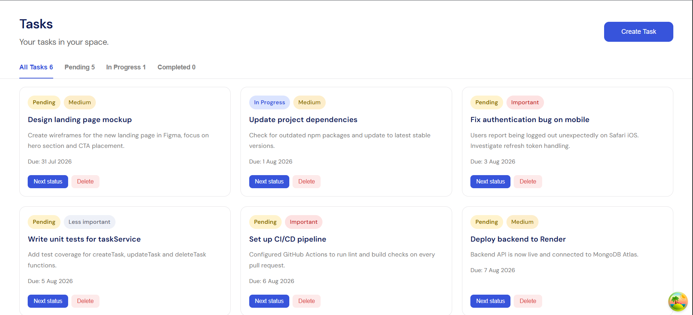
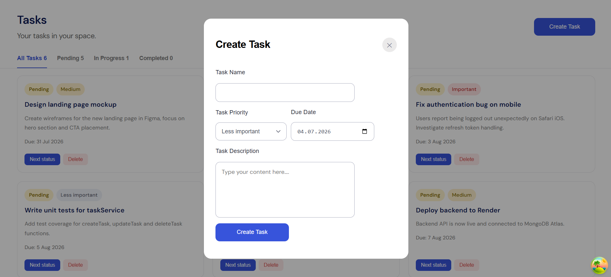

# Task Manager

A fullstack task management application: user registration/authentication, task creation with priority and due date, status filtering, and search.

🔗 **Live demo:** [link after deployment]
🔗 **Backend repo:** [Task Management Backend](https://github.com/RybchynskyiDaniil/task-management-backend)

## Screenshots




## Tech Stack

**Frontend:**

- React 19 + TypeScript
- Vite
- React Router
- TanStack React Query
- Axios
- CSS Modules

**Backend:**

- Node.js / Express
- MongoDB / Mongoose
- JWT (access + refresh tokens, httpOnly cookies)

## Features

- Registration and login with JWT authentication (refresh token stored in httpOnly cookie)
- Protected routes (redirect to `/login` when not authenticated)
- Task CRUD: create, update status, delete
- Task priority (Low / Medium / High) with color-coded badges
- Filtering by status (All / Pending / In Progress / Completed)
- Search tasks by title
- Responsive UI built from a Figma design

## Getting Started

Requires Node.js 20+ and a running MongoDB instance (local or Atlas).

```bash
# clone the repository
git clone https://github.com/RybchynskyiDaniil/task-manager-frontend.git
cd task-manager-frontend

# install dependencies
npm install

# create .env file (see .env.example)
cp .env.example .env

# start the dev server
npm run dev
```

The app will be available at `http://localhost:5173`.

The backend needs to be started separately — see the [backend README](link).

## Environment Variables

## Project Structure

src/
├── api/ # axios instance
├── components/
│ ├── app/ # routing
│ ├── pages/ # pages (Login, Register, Tasks, Settings)
│ ├── TaskCard/ # task card component
│ ├── TaskForm/ # task creation form
│ └── ...
├── services/ # HTTP requests (authService, taskService)
└── main.tsx

## Author

**Daniil**
[GitHub](https://github.com/RybchynskyiDaniil/task-manager-frontend) / [LinkedIn](https://www.linkedin.com/in/daniil-rybchynskyi/)
